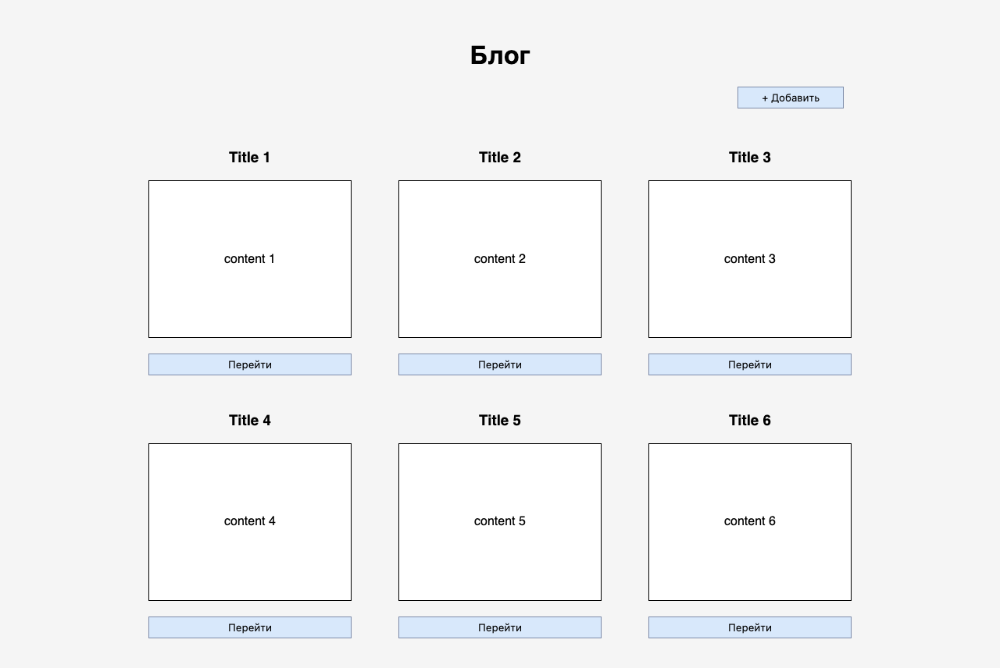
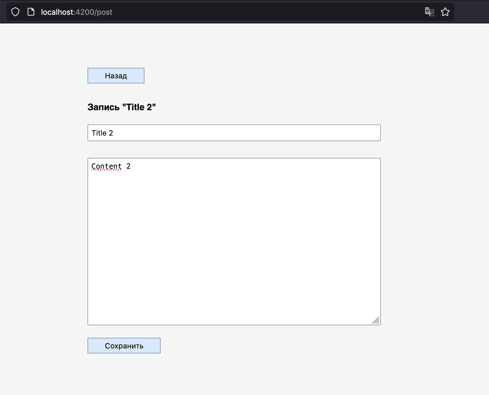
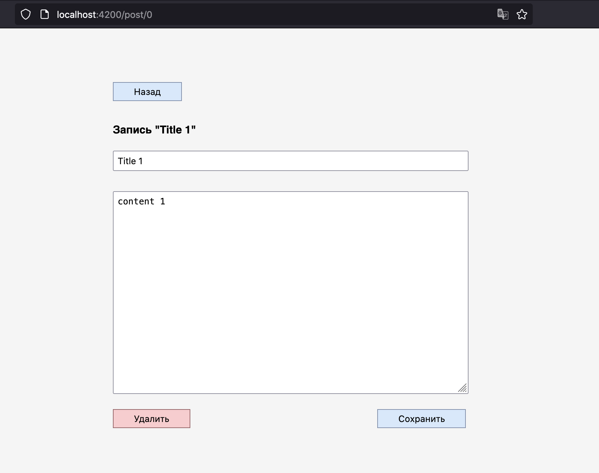
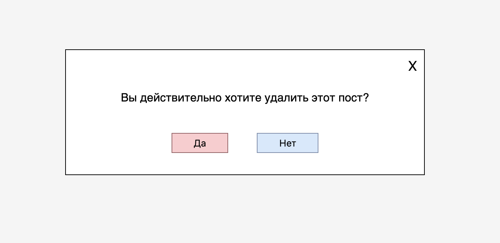

# SiteBlog (Angular)

This project was generated with [Angular CLI](https://github.com/angular/angular-cli) version 12.0.3.

  
  
  
  

# Описание проекта

Страницы :

    1) Список всех записей
    2) Карточа записи

Функционал:

    1) Добавление записи
    2) Удаление записи
    3) Редактирование записи
       Запись состоит из названия и содержания (обычный текст) 

Технические требования: 

    1) Сервер не нужен. Local storage не обязателен, можно стирать данные если закрыть окно.
    2) Использовать роуты для перехода между страницами
    3) Сервис для хранения записей, чтобы в Local storage не класть данные, можно сделать сервис в котором все будет храниться, например, в каком нибудь массиве.
    4) Обязательно: использование two-way binding
    5) Использование angular-аттрибутов для обработки событий (например `(click)` и т.д)
    6) Кнопка "добавить" должна быть "над" всеми элементами
    7) Размер записи статичен, если контент/title очень большой то обрезать (на уровне css)
    8) Для создания записи можно (любой вариант)
    a) переиспользовать страницу записи
    b) сделать модальное окно
    9) При удалении должно появляться окно подтверждения (удалить? да/нет)

## Development server

Run `ng serve` for a dev server. Navigate to `http://localhost:4200/`. The app will automatically reload if you change any of the source files.

## Code scaffolding

Run `ng generate component component-name` to generate a new component. You can also use `ng generate directive|pipe|service|class|guard|interface|enum|module`.

## Build

Run `ng build` to build the project. The build artifacts will be stored in the `dist/` directory.

## Running unit tests

Run `ng test` to execute the unit tests via [Karma](https://karma-runner.github.io).

## Running end-to-end tests

Run `ng e2e` to execute the end-to-end tests via a platform of your choice. To use this command, you need to first add a package that implements end-to-end testing capabilities.

## Further help

To get more help on the Angular CLI use `ng help` or go check out the [Angular CLI Overview and Command Reference](https://angular.io/cli) page.
